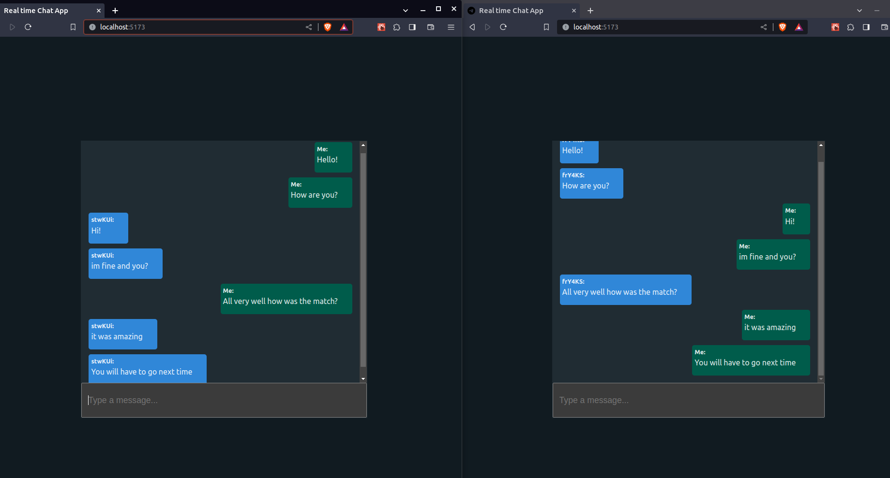

# Real-time-chat-app



**API Deploy:**

## -Pending. (configuring the server with the provider.)

## 🎯 Objective

- Create a real time chat wit socket.io.

---

## 🗝 Features

- Sending and reception of real -time messages from multiple instances of Socket.
- Differentiation of the issuer and receiver messages.

#### Development features:

- Change id for username.
- Add emoticons system.

---

## 🚀 Getting started

### Prerequisites:

- **Node version 14.x**

If you want to run the site locally, you can:

1. Clone the project.

```bash
https://github.com/Johndev85/real-time-chat-app.git
```

2. Go to project's folder

```bash
cd real-time-chat-app
```

3. Open server:

```bash
cd server
```

```bash
npm i
```

```bash
npm run dev
```

4. Open frontend:

```bash
cd frontend
```

```bash
npm i
```

```bash
npm run dev
```

---

## 🛠 Deployment

- Deploy: Render

---

## 🧾 License

- The MIT License (MIT)

---

## ➕ Contributing

- If you want to contribute with this project, just make a Pull Request explaining the improving ✨.

---

## 💻 Technologies:

- React
- Vitejs
- Socket.IO
- Nodejs
- Express
- JavaScript
- CSS3
- HTML5

---
